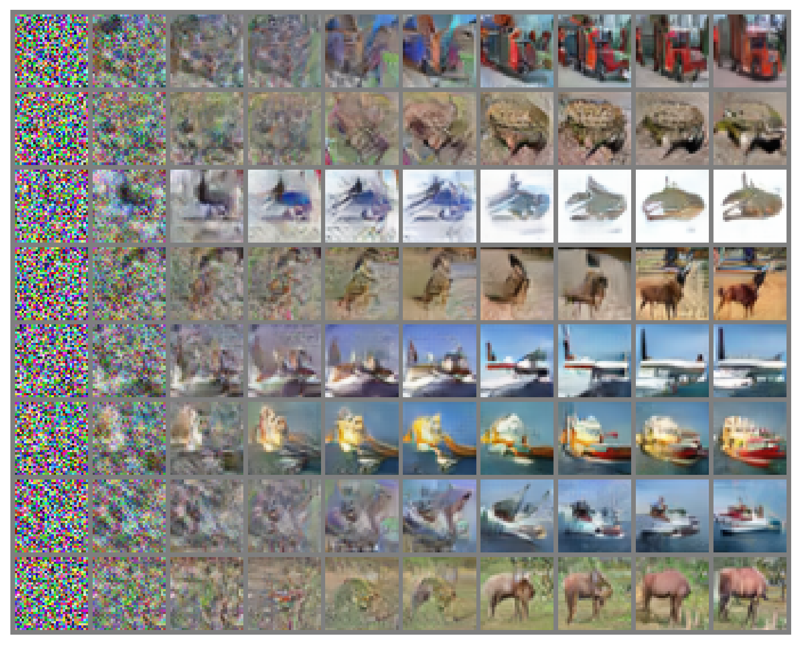

# Variational Wasserstein gradient flow

This is the official `Python` implementation of the paper **Variational Wasserstein gradient flow** (paper on [arXiv](https://arxiv.org/abs/2112.02424)) by [Jiaojiao Fan](https://sbyebss.github.io/), [Qinsheng Zhang](https://scholar.google.ru/citations?user=Bktg6JEAAAAJ&hl=en), [Amirhossein Taghvaei](https://amirtag.github.io/) and [Yongxin Chen](https://yongxin.ae.gatech.edu/).

The repository contains reproducible `PyTorch` source code for computing **Wasserstein gradient flow** with variational estimation of target functional in high dimension.

<p align="center"></p>

## Repository structure

The codebase is tested on CUDA version 11.4 and PyTorch version 1.10.1+cu113.

To reproduce the experiments except image geneation, go to `toy` folder and follow the instructions in `toy/README.md`

```
cd toy
```

To reproduce the experiment of image geneation, go to `image` folder and follow the instructions in `image/README.md`

```
cd image
```

## Citation

```
@inproceedings{
  fan2022variational,
  title={Variational Wasserstein gradient flow},
  author={Fan, Jiaojiao and Zhang, Qinsheng and Taghvaei, Amirhossein and Chen, Yongxin},
  booktitle={International Conference on Machine Learning},
  year={2022}
}
```
